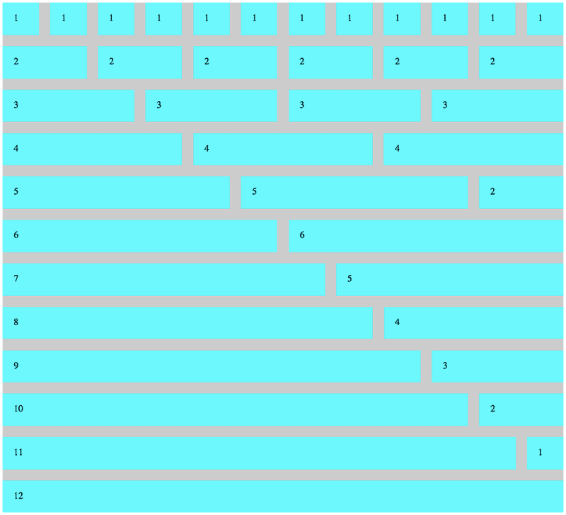

# CSS Light Grid

A light weight 12 column vanilla CSS grid using floats. You can fork and customize as needed. 

## Usage

To use, link include light-grid.css in your css folder. In your html page link to the file `<link rel="stylesheet" href="css/light-grid.css">`. Then include a wrapping element with a class of container. Inside container add an element with a class of row. Inside rows add as many elements with class of col-<number of rows to span>. Column numbers fall between 1 and 12.

## Example

The code below will create 2 rows, the first with 3 columns spanning 4 of the 12 grid and a second row with 3 columns made up of two spanning 5 of 12 columns and one spanning 2 of 12.

```
<div class="container">
  <div class="row">
    <div class="col-4">4</div>
    <div class="col-4">4</div>
    <div class="col-4">4</div>
  </div>
  <div class="row">
    <div class="col-5">5</div>
    <div class="col-5">5</div>
    <div class="col-2">2</div>
  </div>
</div>
```
Here is a display image showing many possible combinations in the browser.



## Demo

See a demo by loading index.html in a browser.

## Created by

jon@flatironschool.com